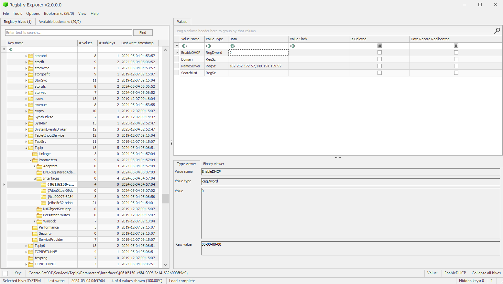

# Did Nobody See?
Description:
```markdown
We recently obtained a triage image from a Windows laptop belonging to a suspected ransomware operator. The suspect used several anti-forensic techniques and managed to erase any form of web history. We suspect that we may be able to use data from DNS servers as evidence to tie the suspect to the operation. Unfortunately, the suspect was using a VPN. Can you find any DNS servers used during the VPN connection?

The answer will be in the form of `byuctf{ip.address}` (there may be multiple answers, any valid IP address for the DNS server will work for the answer).

[did-nobody-see.zip]
```

## Writeup
The challenge is designed to help the competitor learn how to search for specific information in large data sets. In part, it is designed to help a competitor think about how to search for forensic artifacts. The competitor could Google the location of DNS servers on a Windows machine, or they could do regex searches for IP addresses across the artifacts and then search the web for those specific artifact locations.

The information is located in the `SYSTEM` registry hive, at `SYSTEM\ControlSet001\Services\Tcpip\Parameters\Interfaces\`, and then going through each of the four registry keys with various GUIDs until one of them has a populated NameServer. This is because VPN connections create network interfaces when they are installed/used.

Since most network interfaces do not have statically set DNS servers, the only network interface with a DNS server would be from the VPN connection.



**Flags**:
* `byuctf{162.252.172.57}`
* `byuctf{149.154.159.92}`