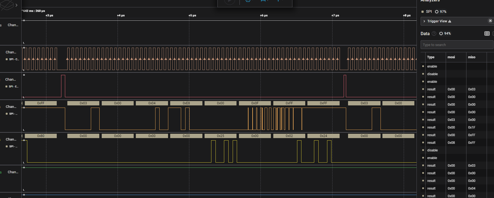

# Sal
Description:
```markdown
A few friends and I recently hacked into a consumer-grade home router. Our first goal was to obtain the firmware. To do that, we hooked up a SOIC-8 clip to the external flash memory chip, connected a Saleae Logic Pro 8 logic analyzer, and captured data using Logic 2 as we booted up the IoT device. The external flash memory chip was Winbond 25Q128JVSQ.

What's the md5sum of `/etc/passwd`?

Flag format - `byuctf{hash}`

[vilo_bool.sal]
```

## Writeup
The CPU chip uses the SPI protocol to communicate with the external memory chip. In our situation, dual SPI is used, meaning only 6 of the eight legs are used (2 of which are VCC and GND). We hooked our SOIC-8 clip to the chip and connected all 8 wires to a Saleae Logic Pro 8 logic analyzer. We set it to use the highest sampling rate possible, connected the analyzer to a laptop which had Saleae's Logic 2 software installed, and captured for approximately 100 seconds. We then plugged in the router and got a lot of data!!



Zooming in a lot displayed data like the data shown above. We saved the data to `vilo_boot.sal`. We then used Logic 2's built-in SPI analyzer, and assigned each channel to a different leg of the chip. This gave us a large table like shown on the right in the picture above. We exported this data to a CSV file and saved it (compressed) to [`vilo_boot.csv.gz`](./solution_files/vilo_boot.csv.gz).

### Decoding SPI Data
Now we needed to analyze this data to see if we can pull any useful files from it. The datasheet for the Winbond external flash memory chip (linked at the top) describes how the SPI protocol works with this chip. Dual SPI has 4 channels (in the same order as the picture above):

* **Clock (CLK)** - each up/down identifies the length of a single bit in MOSI/MISO
* **Enable (/CS)** - each up/down ends the previous SPI instruction and starts a new one
* **MOSI (IO0)** - meaning "Master Out/Slave In", this channel is where the CPU chip sends an instruction (like read or write), followed by addresses and/or data
* **MISO (IO1)** - meaning "Master In/Slave Out", this channel is where the flash memory chip responds to the CPU chip instructions by sending data

There's a lot of data to unpack especially since there are about a dozen different instructions used, including multiple types of read/write. The general structure of SPI is a one-byte instruction will come from the MOSI channel followed by data (structured depending on the instruction). If the CPU wants to read, it will usually send the instruction `0x03` followed by a 3-byte address (taking up 4 bytes). The flash memory chip will then respond with a variable amount of data starting at the address specified through the MISO channel. Typically 4 bytes are returned, but it's possible that more could be sent. Once all the data is sent, the enable channel will change, marking the end of that instruction and prompting the CPU to send another instruction through MOSI.

Due to this protocol, turning the raw data into a usable format for finding files can be difficult. On one hand, if we just combine all of the data read and ignore addresses, non-sequential reads may give us garbled data. However, if we create an array as large as the filesystem and fill in bytes based on their address, then it's possible that multiple writes to a single address will lead to data being overwritten.

Our solution was to [script the retrieval using Python](./solution_files/parse_SPI.py) and keep track of the data both regardless of address (assuming most of the data is read sequentially) AND by placing the data in an array of bytes with the index being the address. We then wrote the data to `data.bin` (not contained) and [`fs.bin`](./solution_files/fs.bin) (respectively).

```python
lines = open('vilo_boot.csv','r').read().split('\n')[1:]
code_sections = []
fs = [0]*(0xffffff+4)
total_data_str = b''


# parse CSV
data1 = []
data2 = []
for line in lines:
    sections = line.split(',')

    if len(sections) > 1 and sections[1] == '"disable"':
        code_sections.append((b''.join([int.to_bytes(x) for x in data1]), b''.join([int.to_bytes(x) for x in data2])))
        data1 = []
        data2 = []

    if len(sections) > 1 and sections[1] == '"result"':
        data1.append(int(sections[2],16))
        data2.append(int(sections[3],16))

print(code_sections[1])

# parse instructions
for s in code_sections:
    bin = s[0]
    instr = s[1]

    if len(instr) == 0:
        continue
    mode = instr[0]

    if mode == 3:
        # read
        addr = instr[1:4]
        data = bin[4:]

        total_data_str += data

        for i in range(len(data)):
            fs[int.from_bytes(addr)+i] = data[i]

fs = b''.join([int.to_bytes(x) for x in fs])

with open('fs.bin','wb') as f:
    f.write(fs)

with open('data.bin','wb') as f:
    f.write(total_data_str)
```

Using binwalk to inspect both `fs.bin` and `data.bin` will reveal several compressed files and filesystems. Running `binwalk -e fs.bin` will reveal an entire squashfs filesystem which contains the root filesystem for the router!!

Simply locate [`/etc/passwd`](./solution_files/passwd) and running `md5sum` will give you the flag.

**Flag** - `byuctf{c8ef3ad94c6eb97f4fa94a0f0ed33980}`