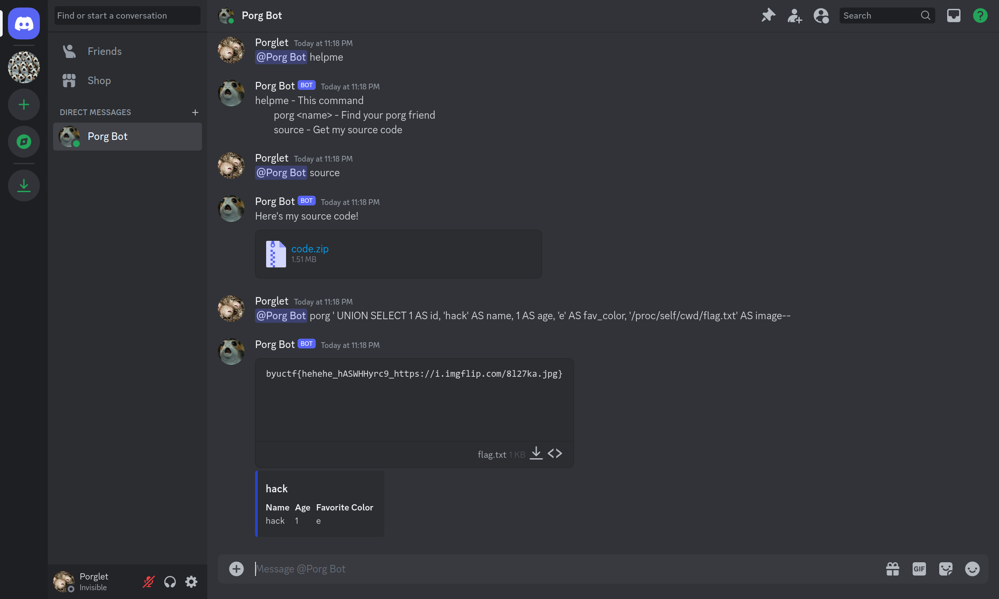
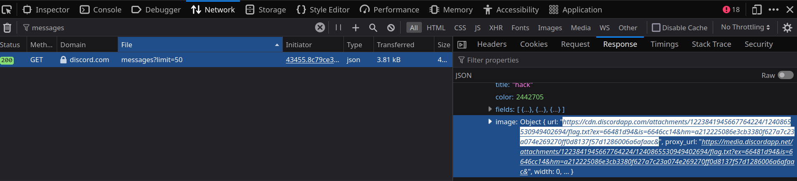

# Porg City
Description:
```markdown
https://discord.gg/YcyXjhgF
```

## Writeup
This is a SQL injection challenge through a Discord bot. After players join the Discord server, they may notice in the list of users a bot named "Porg Bot" which in its description says to DM it with "@Porg Bot helpme" (DMing is required in order to avoid exposing players' solves to each other). This will give them the list of possible commands they can run. No source code is provided in the challenge description, but they can obtain the source code from the bot itself by sending it the `source` command. 

After obtaining the source code, players should notice that the `porg` command runs a SQL query which vulnerable to injection. Because the code uses the results of the query to construct a path for a file it should reply with, the injection can be used to abuse this and have it send the flag.txt file instead.

There are two caveats to this exploit besides the SQL injection. One is that `..` is disallowed from being used in the image path. This can be mitigated by providing a path with `/` at the start, because Python's `os.path.join` will ignore the first part of the path if the second starts with `/`. The second caveat is that the player doesn't know the directory of the app itself because it's randomized and not provided in the source code. This requires them to use `/proc/self/cwd` to get to the Python process's current working directory instead.

Payload:
```
@Porg Bot porg ' UNION SELECT 1 AS id, 'hack' AS name, 1 AS age, 'e' AS fav_color, '/proc/self/cwd/flag.txt' AS image--
```
Note: sometimes, you have to refresh your Discord client to get the attached flag.txt file to show up



**Flag** - `byuctf{hehehe_hASWHHyrc9_https://i.imgflip.com/8l27ka.jpg}`

Note: This was the intended solution for this challenge and was working as of a few days before the CTF. However, Discord appears to have made an update that causes the flag file to no longer appear as an attachment to the message. The flag can still be obtained by sending the same payload, refreshing the page, and using browser developer tools to inspect the network traffic and grab the direct CDN download link for the flag.txt file.



## Hosting
This challenge should be a Docker container that runs a Discord client with no external ports. All the proper files are included in here. The command to build and run the docker container is (when located inside of this directory):

```bash
docker compose up -d
```

To stop the challenge:
```bash
docker compose down
```